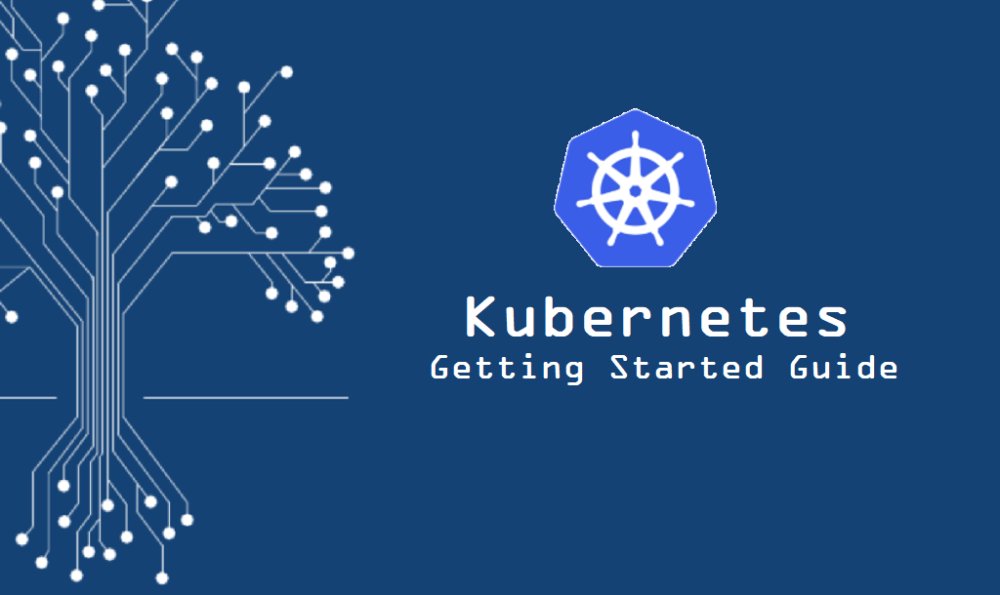

### theITHollow Kubernetes Guide

This repository includes the code samples from the [Getting Started With Kubernetes ](https://theithollow.com/2019/01/26/getting-started-with-kubernetes/) blog posts from [theITHollow](theithollow.com).

Each of the folders starting with a number, correspond with one of the blog posts in the list.

Also included within this repo is the application used in the examples.

The blog posts in the series should provide a good jump start in to using Kubernetes and the code samples will provide useful hands on with the concepts. 

NOTE: In order to follow the guide, you will need to have a Kubernetes cluster installed, that has integration with a cloud provider such as vSphere, AWS, GCP, etc. The examples shown require things such as Load Balancers, and elastic storage to fully follow the guide.

[1-Pods](1-Pods)

[2-Replica Sets](2-ReplicaSets)

[3-Deployments](3-Deployments)

[4-Services](4-Services)

[5-Endpoints](5-Endpoints)

[6-Service Publishing](6-ServicePublishing)

[7-Namespaces](7-Namespaces)

[8-Context](8-Context)

[9-Ingress](9-Ingress)

[10-DNS](10-DNS)

[11-Config Maps](11-ConfigMaps)

[12-Secrets](12-Secrets)

[13-Persistent Volumes](13-PersistentVolumes)

[14-Cloud Providers - Storage Classes](14-CloudProviders-StorageClasses)

[15-RBAC](15-RBAC)

[18-Taints and Tolerations](18-TaintsAndTolerations)

[19-Daemon Sets](19-DaemonSets)

[20-Network Policies](20-NetworkPolicies)

[21-Pod Security Policies](21-PodSecurityPolicies)
